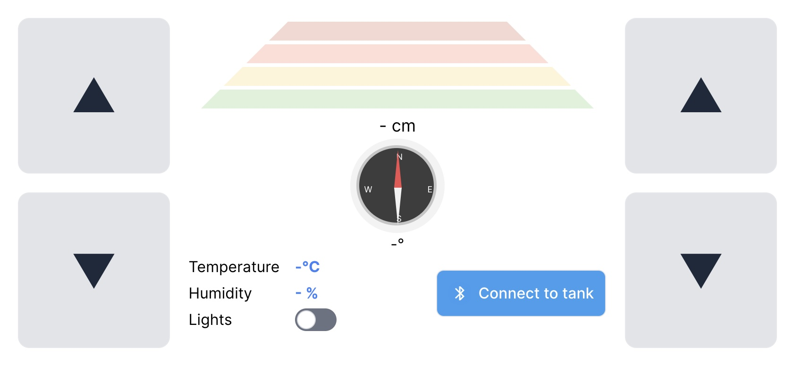

# Tank Control App

The control app is a regular web application written in React.js and uses [Web Bluetooth API](https://developer.mozilla.org/en-US/docs/Web/API/Web_Bluetooth_API) for connecting and communicating with the bluetooth module of the tank.

Once the connection is established, you can read sensor values from the board and also control the tank movement with the buttons.

The app is written in React and uses Tailwind.
